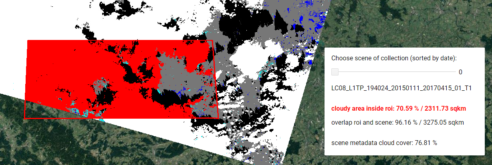

# GoogleEarthEngine-side-projects

Google Earth Engine is a cloud-based processing platform for earth observation and geospatial data. 
https://earthengine.google.com/  

**Miniapp_least_cloudcover_in_roi**

**Detect_areas_longterm_EVI_trends**

**US_annual_degree_growing_days**

