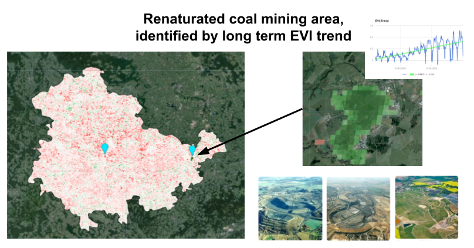

# GoogleEarthEngine-side-projects

https://earthengine.google.com/  
Javascript Code Editor:  
https://code.earthengine.google.com/  
Python API:  
https://developers.google.com/earth-engine/python_install  

**Miniapp_Least_Cloudcover_inside_aoi**

**Detect_areas_longterm_EVI_trends**

**US_DD_degree_growing_days**

